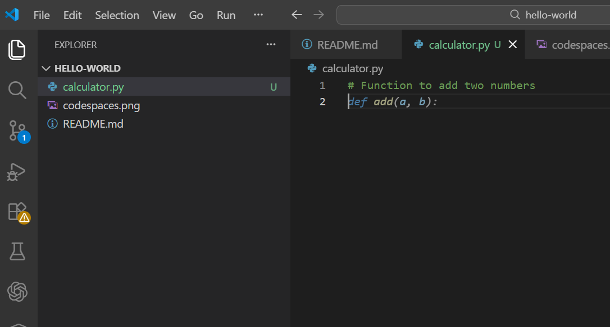
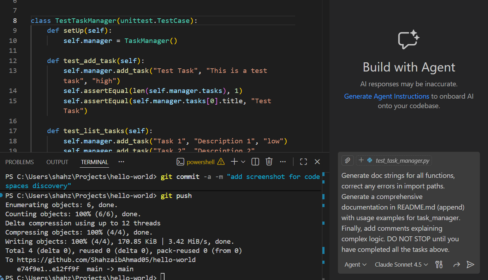
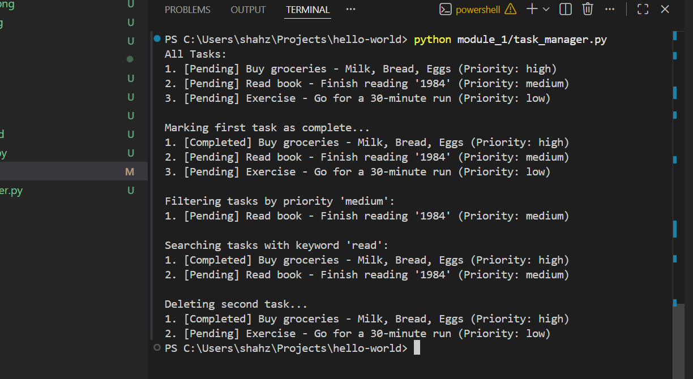
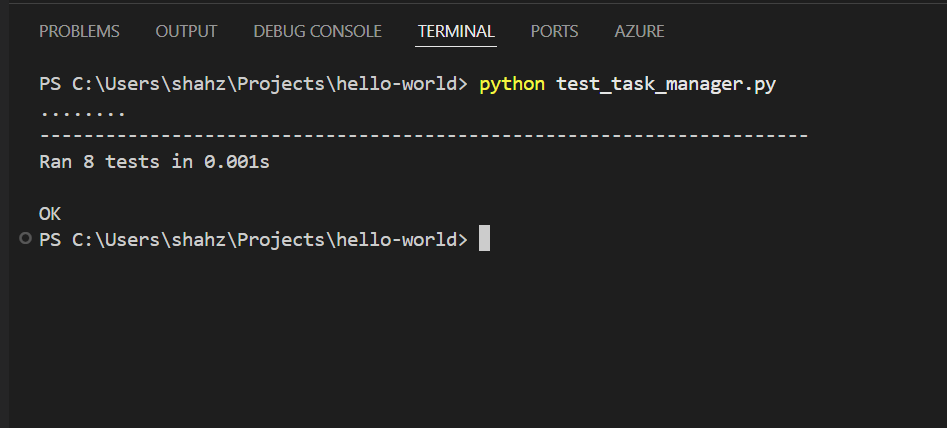
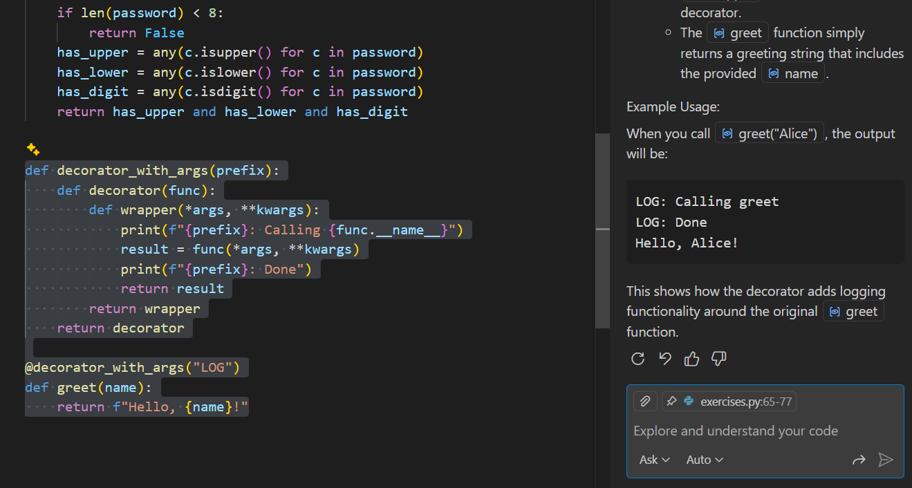
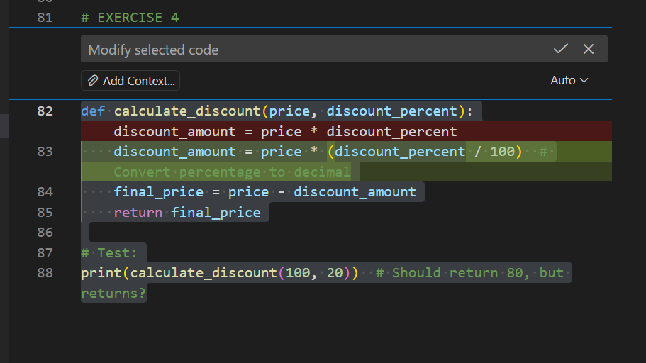
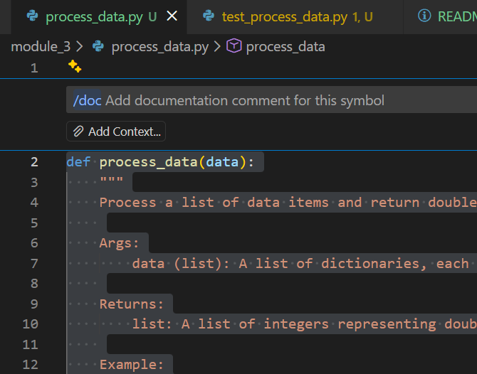
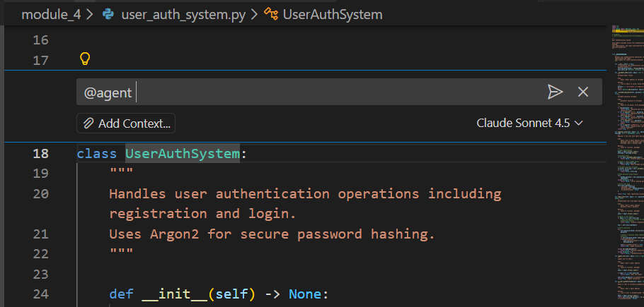
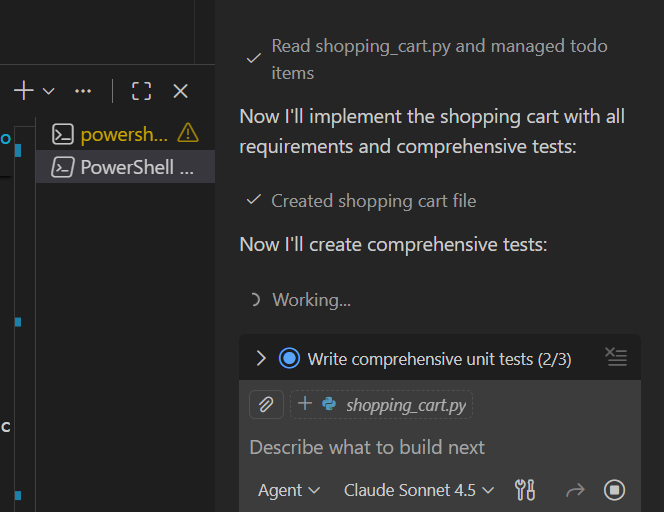

# Hello World

This is obviously not my first GitHub repository!

## About Me
I'm a software engineer at SEECS, NUST, learning GitHub and AI-powered development.

## Module 1

- Learned about GitHub codespaces!

- And discovered that it works with VSCode Live Share, although, I don't use that extension much when working in teams. (except when I have to work in a pair programming setup)


- This will surely help boost productivity

- I never knew that VSCode auto-complete suggestions can be used in so many different ways!



- Used co-pilot as usual to generate documentation for the task manager created in module_1 lab.



- Created a task Manager using just autocomplete and code comments



- Added unittests for the task manager (like i always do)



---

## Module 2

- Learned a lot of useful shortcut keys for using co-pilot suggestions!

- The /explain feature can be quite handy when dealing with other people's code:



- The /fix feature can also be very handy:



- Same goes for the /rewrite feature

- **Reflection on exercise 1 of unit 2**

Use of different modes for different tasks is quite interesting plus useful. I personally prefer using ChatGPT for the "ask" mode, generally, to save premium copilot requests.

However, the "edit" mode is actually useful when we already have the implementation and just need some quick edits for improvements, and I would use that mode from now on. 

- **Reflection on exercise 2 of unit 2**

Python - Uses a tuple that returns the success message, regex for email validation. It could raise exceptions in case of errors.

Javascript - Uses async/await and throws errors for validation failures. Uses regex patterns, and try/catch blocks to handle errors.

Typescript - Uses type annotations and interfaces, uses type safety instead of tuples and for error handling, it should throw an error or return a `Result` type.

- Python generators? js question, Docker?? optimizing SQL queries??

Python generators: Functions using yield that produce values lazily one at a time, saving memory; use for large datasets or infinite sequences.

var, let, const in JavaScript: var is function-scoped and hoisted, let is block-scoped and reassignable, const is block-scoped and immutable reference.

Docker purpose: Containerization platform that packages applications with dependencies into isolated containers using OS-level virtualization for consistent deployment.

SQL query optimization: Use indexes, avoid SELECT *, limit result sets, optimize JOINs, partition tables, use query execution plans, and cache frequently accessed data.

- Best way to implement caching?

For the user registration system, the best caching approach would be:

Cache user lookups by email and ID (most frequent operations)
Use TTL (Time-To-Live) to prevent stale data
Implement cache-aside pattern - check cache first, then database
LRU eviction for memory management
Cache invalidation on user updates/deletions
Thread-safe operations for concurrent access


- How do I test caching?

To test caching behavior effectively, you should:

Test cache hits and misses - Verify data is cached on first access and retrieved from cache on subsequent calls
Test TTL expiration - Ensure cached data expires after the configured time
Test cache invalidation - Confirm cache clears when data is updated/deleted
Test LRU eviction - Verify old entries are evicted when cache is full
Test thread safety - Ensure concurrent access works correctly
Measure cache performance - Verify hit rate and response time improvements
Test cache statistics - Validate metrics are tracked correctly


- For the full-stack lab, the tasks were quite interesting. I have put that system in `module_2/task_management_system/`

- As for the questions, I have answered them in REFLECTION.md in the same directory.

---

## Module 3

- Learned and used some more slash commands. `/doc` is really useful for doing the tiring work of adding documentation, however, the doc LLMs generate still has to be reviewed by a human.



- For exercise 4, I used GPT-4.1 and GPT-4o, there responses were very brief and less detailed compared to the usual GPT-5.2 or Claude-Sonnet-4.5 I use. 

- Comparing those two with each other, the documentation GPT-4o prepared was much more detailed than the code file that was created by GPT-4.1

- Their responses in the VSCode chat were quite similar though.

- Completed the lab, now moving on to unit 2!

### Unit 2

- Refining a prompt, (prompt engineering??), that is essentially what I do all the time, everyday.

```bash
# Refined prompt
I need a Python function to sort a list of 100,000 Product dictionaries for an e-commerce app. The input dictionaries contain name, price, and stock_count. The function must be highly performant (O(n log n)). Please implement a custom sort key that prioritizes in-stock items first, then orders by price (low-to-high), and finally by name as a tie-breaker. Return the result as a new list.
```

- Zero-shot and few-shot approaches, yes, the results were quite different for the few-shot approach. This indicated that context matters for autocomplete.

- Prompt Engineering, yes again. This is the prompt I typed:

```bash
Act as a Senior Backend Engineer and create a secure Node.js Express registration endpoint (POST /api/v1/register) using Mongoose that validates a unique email, a 3–20 character alphanumeric username, and a strong 12+ character password containing uppercase letters, numbers, and symbols using express-validator. The logic must check for existing users, hash the password using bcrypt with 12 salt rounds, and save a new user document with role: 'user' and is_verified: false inside a try-catch block. Ensure the response is returned as JSON with a 201 status and the user ID on success (without the password hash), a 400 status with specific error messages for validation or duplication failures, and a 500 status with a generic message for internal errors to prevent stack trace leaks.
```

- For the lab, everything is documented and done in `module_3/lab/`

- Module 3 complete!

---

## Module 4

- Using @agent after pressing `Ctrl + I` is pretty fast compared to opening the side chat and typing the task there.



- Custom Instructions? that is something new to me. 

- I realized that Custom instructions are quite effective, and they save a lot of time. I'll be using them in my workflows from now onwards.

- Module 4 complete!

## Module 5 

- This module seems to be quite easy-going

- Generating test cases with copilot and then reveiwing the generated tests is quite the natural thing to do\



- The lab is done and completed. Module 5 complete!


---

## Module 6

- This module involves the capstone project.

- I have decided to build a markdown-to-html converter for this capstone project. 

- The project can be viewed [here](https://github.com/ShahzaibAhmad05/md-to-html-converter)

---

# My Experience

- I have documented everything I learned throughout my training in the README above. However:

- This was a GREAT learning experience. I learned a lot on how I can effectively use copilot in my workflow, and will be using the techniques I learned from now onwards.

- As for the productivity increase, I would say my coding efficiency has increased by about 20% to 30% immediately after this training, even though I had experience using tools like GitHub copilot, and Cursor AI well before stumbling on this training.
