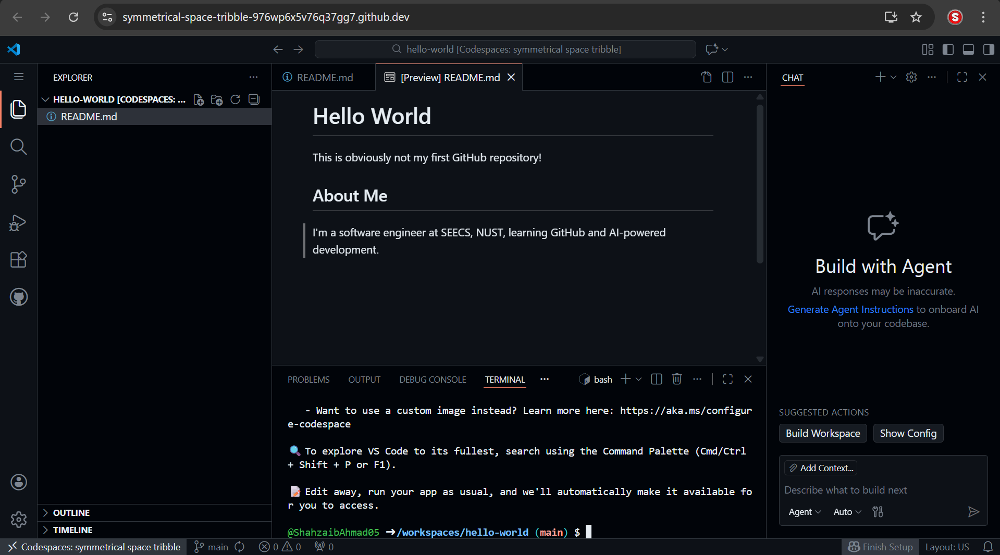

# Hello World

This is obviously not my first GitHub repository!

## About Me
I'm a software engineer at SEECS, NUST, learning GitHub and AI-powered development.

## Learned about GitHub codespaces!

And discovered that it works with VSCode Live Share, although, I don't use that extension much when working in teams. (except when I have to work in a pair programming setup)

